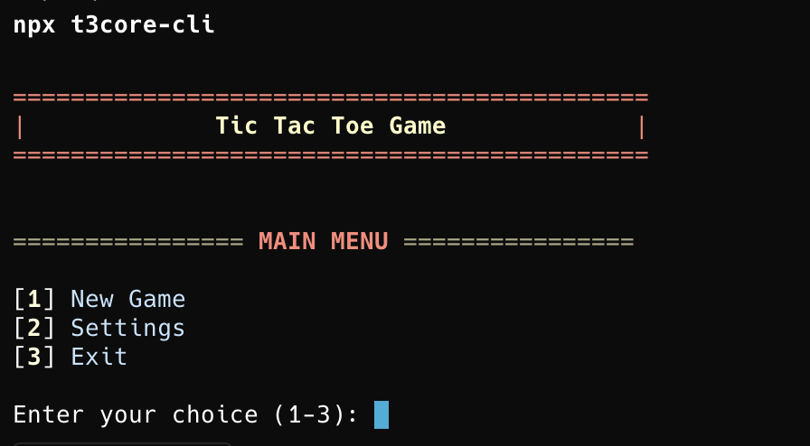
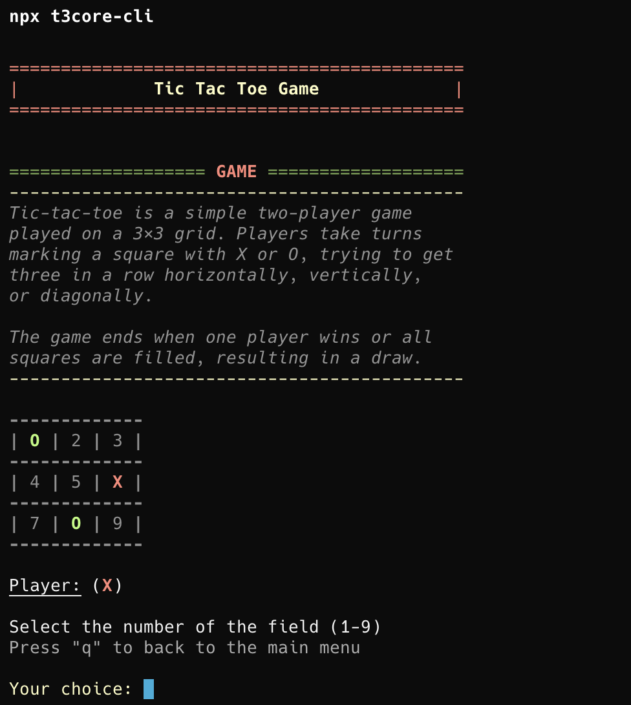
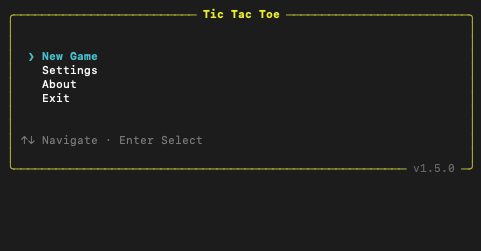
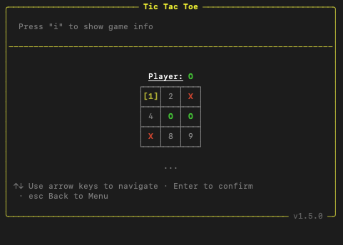

# Release v1.6.0

Complete UI rewrite — migrates the CLI from a legacy command-line interface to an interactive Ink-based React UI with persistent settings, game history, and arrow-key navigation.

## Before

## After

---

## Changelog

## [1.6.0] - 2026-08-13

### Requirements

- Minimum Node.js version raised from 16 to 20

### Added

- Complete interactive UI built with Ink (React for terminals)
- React Router navigation with type-safe routing between Home, Menu, Settings, Game, and About screens
- Two-player Tic Tac Toe game with full board rendering, win/draw detection, and play-again prompt
- Persistent settings via Zustand store with Conf storage:
  - Sound effects (beep on moves and navigation)
  - Arrow-key navigation toggle
  - Game history toggle
- CLI flags for overriding settings and choosing initial screen: `--screen`, `--sound`, `--arrowNav`, `--showHistory`, `--mobile`
- Move history view with navigation and rollback support
- Optional game info panel (toggle with `i`)
- Exit confirmation prompt on home screen (`q` → `y`/`n`)
- Header component with app title and version display
- Footer component with contextual hints and validation feedback
- Global text input component with validation schemas (Zod)

### Changed

- TypeScript upgraded to 6.0.0
- GitHub Actions workflows upgraded to Node.js 22
- Build tooling migrated from tsx to tsup with treeshaking
- Board components support `dimColor` for history mode visual feedback
- `NavList` component supports `numberOffset` and `keyExtractor` props for customizable rendering

### Fixed

- `isSpecialKey` in go-back navigation now correctly checks key pressed state instead of key name existence

[1.6.0]: https://github.com/TenGosc007/t3core-cli/compare/v1.5.0...v1.6.0
