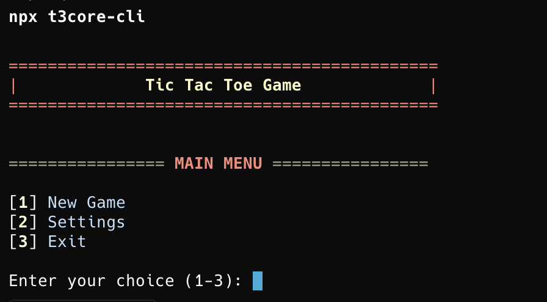
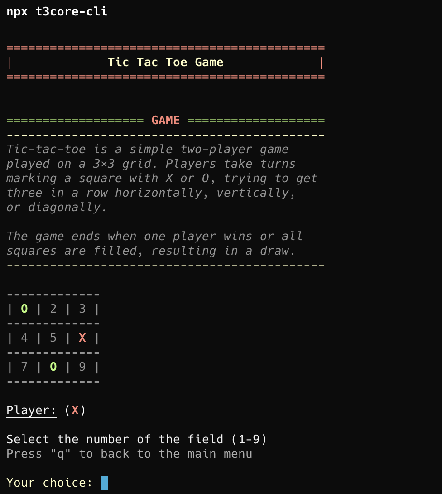

# t3core-cli

Interactive Tic Tac Toe game for your terminal, powered by [t3core](https://github.com/TenGosc007/t3core).

## Play instantly — no installation needed

```bash
npx t3core-cli
```

## Or install globally

```bash
npm install -g t3core-cli
t3core-cli
```

## Screenshots




## Features

- Two-player Tic Tac Toe in the terminal
- Interactive menu with settings
- Optional arrow-key navigation in interactive terminals
- Colored symbols and styled board, with styling toggle
- Sound toggle and reset-to-default settings
- Move history view and rollback support
- Optional game info panel
- Win and draw detection
- Play again prompt

## Controls

### Menu

- `1` starts a new game.
- `2` opens settings.
- `3` exits.

### Game

- Enter a field number from `1` to `9` to place a move.
- When arrow-key navigation is enabled, use arrow keys to choose a field and `Enter` to confirm.
- Press `h` to show or hide move history after at least one move.
- Press `i` to show or hide game info.
- Press `q` to return to the main menu. In arrow-key mode, `Esc` and `Backspace` also return to the menu.

### Settings

- `1` toggles sound.
- `2` toggles styling.
- `3` toggles arrow-key navigation when the terminal supports it and styling is enabled.
- `4` resets settings to default.
- Press `q` to return to the main menu. In arrow-key mode, `Esc` and `Backspace` also return to the menu.

## Requirements

- Node.js >= 16.0.0

## Related

- [t3core](https://www.npmjs.com/package/t3core) — the reusable TypeScript core library used by this CLI (also works with React, Next.js, and any JavaScript project)
